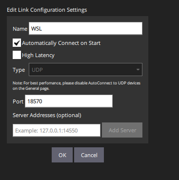

# PX4-Toolbox-SITL-SFunction

(under development - examples coming soon)

This repository contains the S-Function CPP and header files for interfacing simulink with PX4 SITL. The S-Function takes in a few parameters from the simulink model and packages them into a MAVlink message that is sent over TCP port 4560 (see [PX4 simulation website](https://docs.px4.io/main/en/simulation/#default-px4-mavlink-udp-ports)) and allows for custom dynamics to be tested and integrated with other frameworks such as ROS.

## Required from Simulink

* IMU (acc_x, acc_y, acc_z) [m/s^2]
* Gyro (gyro_x, gyro_y, gyro_z)
* Mag (mag_x, mag_y, mag_z) [uT]
* Pressure (from barometer sim) [Pa]
* LLA (lat, long, alt from gps sim)
* Velocity (x, y, z seen by gps)
* Course (direction of travel seen by gps)
* time (using the clock converted to usecs)

## Installation

1. Clone this repo into the root folder of your dynamics model.
2. git submodule init
3. git submodule update --recursive --remote
4. Build the cpp file with the build.m file and replace your matlab install location.
5. Connect the inputs from your model and output to a rate controller and selector block. (Currently working on a way to bypass further processing in simulink)

## Running the simulation

1. Run the simulink model.
2. In your WSL environment run: export PX4_SIM_HOSTNAME="windows ip address"
3. Open QGC and connect to port 18570  
  
5. If you want to connect ROS to the sitl: roslaunch mavros px4.launch fcu_url:=udp://:14540@"windows ip":14550
